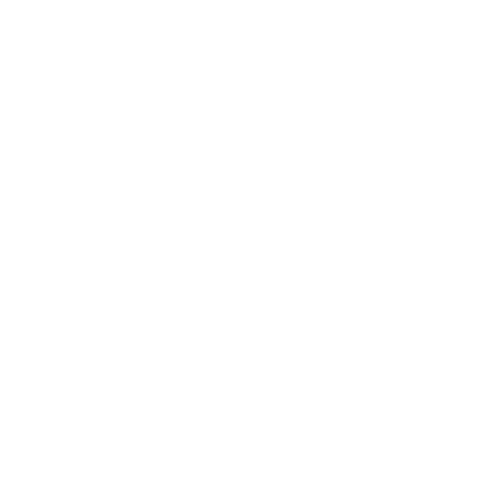

# Quicktool

<p align="center">
  
</p>

<p align="center">
  A community-driven style guide and guideline enforcement toolkit for Quickshell projects.
</p>

<p align="center">
  <a href="/wiki/Rules">Rules</a>
  ·
  <a href="/wiki/Badges">Badges</a>
  ·
  <a href="#contributing">Contributing</a>
</p>


## What is Quicktool?

Quicktool provides a consistent set of conventions, best practices, and automated checks for projects built with Quickshell.

The goal is simple:

- Consistent project structures
- Readable QML code
- Predictable naming conventions
- Maintainable repositories
- Easier collaboration between Quickshell developers

Think of it as:

> Clippy, ESLint, and a style guide — but for Quickshell projects.

---

## Features

- Recommended project layouts
- QML style conventions
- Static analysis rules
- Documentation guidelines
- Repository compliance badges
- CI integration
- Extensible rule system


## Philosophy

Quicktool follows several core principles:

### Readability First

Code is read far more often than it is written.

### Convention Over Preference

Projects should look familiar to contributors.

### Explicitness

Avoid hidden behavior and surprising abstractions.

### Community Driven

Rules are discussed and improved openly.

## Rules

Check out the [Rules](/wiki/Rules) file for more information.

# Badges

Repositories following Quicktool guidelines can display badges.

## Compliance

```md

```

Result:


## Contributing

Contributions are welcome.

Before opening a pull request:

1. Follow Quicktool guidelines.
2. Ensure checks pass.
3. Document new rules.
4. Keep discussions constructive.

## License

MIT

---

<p align="center">
Built for the Quickshell ecosystem.
</p>
<p align="center" style="font-size: 0.8em">
Supported by QsCommunity
</p>